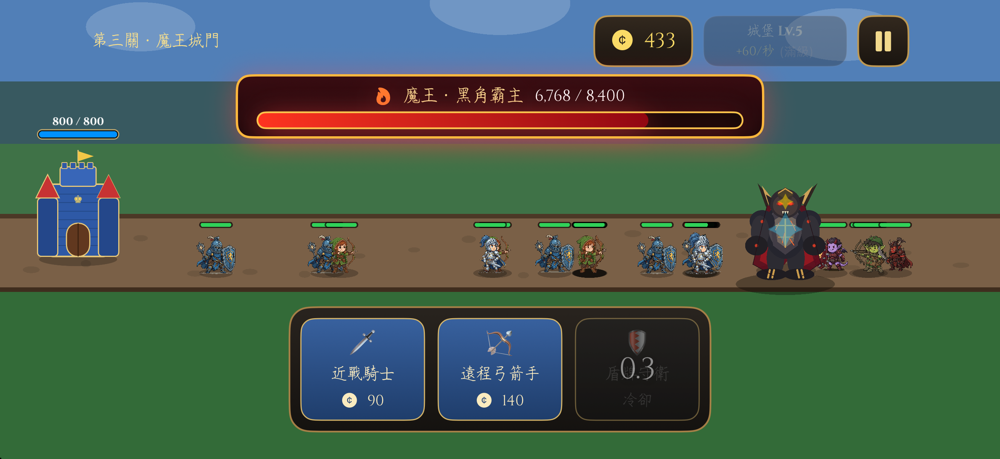

<div align="center">
  <h1>🏰 Tower Defense</h1>
  <p>
    
    
    
    
  </p>
  <p><i>一款以 SwiftUI 與 SpriteKit 打造的塔防遊戲</i></p>
</div>

---

## 📸 遊戲畫面 (Screenshot)

<div align="center">
  
</div>

## ✨ 遊戲特色 (Features)

- ⚔️ **兵種相剋與戰略**：招募重裝盾衛 (Guardian)  扛傷、遠程弓箭手 (Archer) 輸出，以及近戰騎士 (Knight) 推進戰線！
- 🏰 **城堡與經濟升級**：投資資源升級城堡等級，提升金幣獲取速度，在戰局中取得經濟優勢。
- 🐉 **史詩級魔王戰**：打到最終關卡「魔王城門」，迎擊擁有超高血量與範圍攻擊的首領，體驗壓迫感十足的決戰。
- 🗺️ **多重關卡與難度**：從綠野到高地，再到魔王城門，敵軍生命值、攻擊力與生成速度逐步提升，挑戰您的極限。
- 🎵 **極致視聽饗宴**：專屬遊戲配樂 ＆ 豐富的戰鬥音效（物理打擊、冷兵器碰撞與盾牌防禦），打擊感滿分。

## 🚀 快速開始 (Getting Started)

1. 確保您的 Mac 已安裝最新版 **Xcode**。
2. 將本專案 Clone 或下載至您的本地電腦：
   ```bash
   git clone https://github.com/Cute-Lime/TowerDefense.git
   ```
3. 在 Xcode 中開啟 `TowerDefense.xcodeproj`。
4. 選擇適合的 iOS 模擬器（強烈建議使用**橫向**模式的 iPhone 15 Pro 或以上機型）。
5. 點擊左上角的 ▶️ Play 按鈕或使用快捷鍵 `Cmd + R` 建置並執行遊戲！

## 🛠️ 開發技術 (Tech Stack)

- **UI 架構**: `SwiftUI` (主選單、HUD 介面與遊戲狀態面板)
- **遊戲引擎**: `SpriteKit` (2D 物理碰撞、節點操作與位移動畫)
- **狀態管理**: MVVM 與全局 `GameState` 狀態機，控制遊戲心跳 (Tick) 與資源計算
- **音訊管理**: `AVFoundation` 打造的客製化 AudioManager
